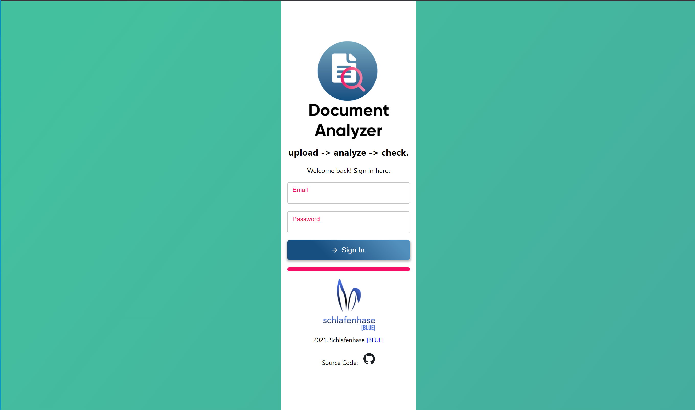
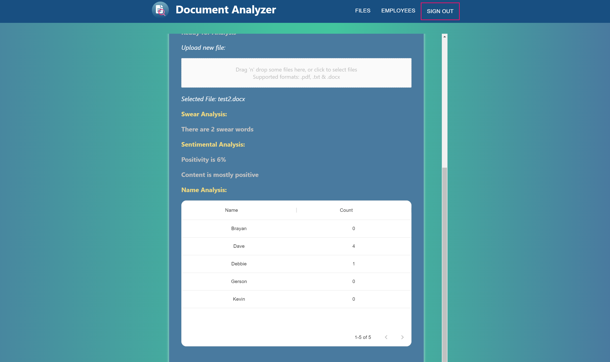
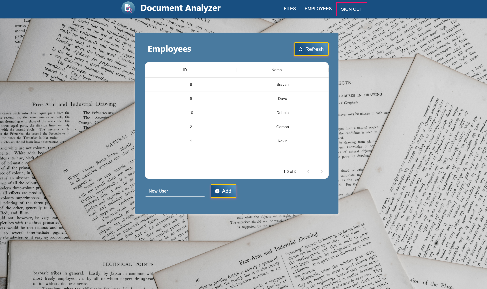

# Document Analyzer 📄🔍

<p align=center></p>

Document Analyzer is a three-layered app to process and analyze company documents for sensitive or specific strings of information. It features a **React** website, **ASP .NET Core** as a REST API and a mixture of databases with **Microsoft SQL Server**, **MongoDB** & **Azure Blob Storage**.

Main features:

* Classic gradient-inspired look with Material UI
* Simple way to upload and check documents for swear, name and sentiment analysis
* Automatic document analysis with Natural Language Processing (NLP) and AI neural networks
* Support for **.txt**, **.docx** and **.pdf** files
* Single-Sign-On (SSO) authentication system
* Integrated app architecture for easy deployment
* Responsive cross-platform compatibility
* Seamless Docker Compose deployment

## Photos 📷

Sign In View                       | Files View                      |
:-------------------------:|:-------------------------:|
|  

Files View - NLP Analyzed                       | Add Employees View                      |
:-------------------------:|:-------------------------:|
|  

## Getting Started 🚀

These instructions will get you a copy of the project up and running on your local machine for development and testing purposes.

### Prerequisites 👓

Software you need to install to run this project:

```
Website Client - React version 17 or higher
Services REST API and Name Analyzer - .NET Core 5.0.6 or higher
Database - MongoDB version 4.4 or higher, Microsoft SQL Server 2019 or higher
Object storage - Any external server that supports downloading/uploading files. We use Azure Blob Storage. 
Swear Analyzer - Python 3.8 with scikit-learn v0.19.2 (be careful with newer ones)
Sentiment Analysis - Go version 1.16.5 or higher
```

### Installing 💻

### Docker (Recommended)

This project is completely set up with the Docker container system. Simply install the default Docker software for your operating system and execute the command **docker-compose up** to automatically compile, set up and deploy source files to your local system. This way, you may modify each part of the application as a developer using your preferred tool or IDE and ensure consistency betwen different environments.

The Compose file written in YAML is located in the root directory as docker-compose.yml. Built docker images for every part are located in a DockerHub repository in [Document Analyzer - DockerHub](https://hub.docker.com/repository/docker/jaibarra/document-analyzer)

### Standard (No Docker)

#### Web 🕸

First, copy the repository on your local machine to get started. The **Web** folder contains all webpage data. Navigate to that directory using Terminal or the equivalent app in your operating system that supports NodeJS commands. Then, run the following:

```
npm i
```

This will install all required dependencies for the React web project, as denoted on the file *package.json*. Once that's done, you may now run the local development server using the following command in the same directory.

```
npm start
```

If the above command doesn't work, try installing the Yarn package manager and executing *yarn run start*.

This will start the React development server associated with this project. You can access it at any browser, just type **localhost::3000** in the search bar. Be careful to not close the terminal window, as this will stop the server. You may also use NodeJS or React (Yarn) plugins in your IDE that allow you to run the previous terminal command. 

At this IP address you can check out a general view of the app, but for the full experience you'll need to run the API, which is supported on Microsoft Windows, macOS and GNU Linux with the help of .NET Core. Setup will be discussed in the subsection below.

If the Services API and databases are already up and running, open the file **constants.ts** and change the *baseURL* string to the public IP address where the API is hosted.

#### Services API & Databases ⚙

It's possible to run the server on a computer connected to a local area network and use the website from other devices, but it's important that both database and API run on the same computer, as they communicate and exchange information. To connect from another device on a local network, simply replace the domain "localhost" with the IPv4 address of the server machine. On Windows, the IPv4 address is accessed by running the command *ipconfig* through cmd. On macOS you can go to System Preferences and select *Network* to display the machine's current IP Address.

To start, grab a copy of Microsoft SQL Server as well a MongoDB (We tried the Community edition and it worked well) and install it locally. Download Visual Studio (not Code) and add the **.NET Core** dependencies required to run these projects. Then open **DocumentAnalyzerAPI.sln** located in the **BackEnd/Api/** folder. Press the start button to run the API on your local network.

This will automatically create the necessary databases in SQL Server using the entities defined by .NET Core's Entity Framework. By default, it will try to connect to a local database instance on port 27017:27017. However, this will only work in Microsoft Windows platforms, because MS SQL Server only runs natively there. If required to run the API on a different operating system, modify the SQL Server connection string coded in *ConnectionStrings* attribute, located in the file **appsettings.json**.

Finally, the client web app should update with the server information. The MongoDB Database will be created automatically and will continue to operate by itself in a local instance, but the same **appsettings.json** file allows for a different instance assigned to a specific connection string in the attribute *MongoDatabaseSettings*. For file storage it's also important to set the corresponding tokens for connecting to an Azure Blobs server. These are found in conjunction with the SQL Server and MongoDB connection strings.

You may now change the *baseURL* string in the web app, as explained above. This will allow you to test the app's full functionality. 

Next, it is necessary to run the analysis services, which are dockerized in each of the three folders located in **BackEnd/Services**, as well as the Keycloak and RabbitMQ instances. These are located in the Compose YAML file and must be run from here to avoid possible mistakes with port configurations.

Our tests were made on Windows, macOS and Linux computers running React 17.0.3, Visual Studio and SQL Server 2019 for the full stack. A CI pipeline was also implemented with GitHub Actions on this repository for build, test and code quality analysis purposes.

## Deployment ✅

For deployment on a live system, run **docker-compose up** on the root directory to automatically deploy a live system.

## Built With 🛠

<table>
  <tr>
    <td>
      <p align=center></p>
    </td>
    <td>
      <p align=center></p>
    </td>
    <td>
      <p align=center></p>
    </td>
    <td>
      <p align=center></p>
    </td>
    <td>
      <p align=center></p>
    </td>
    <td>
      <p align=center></p>
    </td>
    <td>
      <p align=center></p>
    </td>
  </tr>
  
  <tr>
    <td>
      <p align=center><a href="https://reactjs.org/"><b>React</b></a>
      </br>Web Framework</p>
    </td>
    <td>
      <p align=center><a href="https://dotnet.microsoft.com/"><b>ASP .NET Core</b></a>
      </br>Services API and Name Analyzer</p>
    </td>
    <td>
      <p align=center>
        <a href="https://www.mongodb.com/"><b>MongoDB</b></a>
      </br>NoSQL Database</p>
    </td>
    <td>
      <p align=center>
        <a href="https://www.microsoft.com/en-us/sql-server/sql-server-2019"><b>Microsoft SQL Server</b></a>
      </br>SQL Database</p>
    </td>
    <td>
      <p align=center>
        <a href="https://azure.microsoft.com/en-us/services/storage/blobs/"><b>Azure Blob Storage</b></a>
      </br>File Storage</p>
    </td>
    <td>
      <p align=center>
        <a href="https://www.python.org/"><b>Python</b></a>
      </br>Swear Analysis</p>
    </td>
    <td>
      <p align=center>
        <a href="https://golang.org/"><b>Go</b></a>
      </br>Sentiment Analysis</p>
    </td>
  </tr>
</table>

## Docs 📖

Refer to the [**Docs**](https://github.com/Schlafenhase/Document-Analyzer/tree/master/Docs) folder at the root of the project for more information about usage and organization.

## Authors 👨🏻‍💻

### *Schlafenhase [BLUE] Development Team* 🐰💙

* **J.P. Alvarado** - *Lead Developer on Front-end Interaction* - [juan230500](https://github.com/juan230500)
* **Kevin Cordero** - *Lead Developer on Back-end & Connections* - [Skryfall](https://github.com/Skryfall)
* **J.A Ibarra** - *Project Manager & DevOps. Lead Designer* - [AlejandroIbarraC](https://github.com/AlejandroIbarraC)
* **Jesús Sandoval** - *Lead Software Architect* - [shuzz22260427](https://github.com/shuzz22260427)

## License 📄

This project is licensed under the MIT License - see the [LICENSE.md](https://github.com/Schlafenhase/Document-Analyzer/tree/master/LICENSE.md) file for details

## Acknowledgments 📎

* Costa Rica Institute of Technology
* Isaac Ramírez - [GitHub](https://github.com/IsaacSNK)

<p align="center">
                                                                             
</p>
<p align="center">This project was made with academical purposes. Schlafenhase [BLUE]. 2021</p
```
